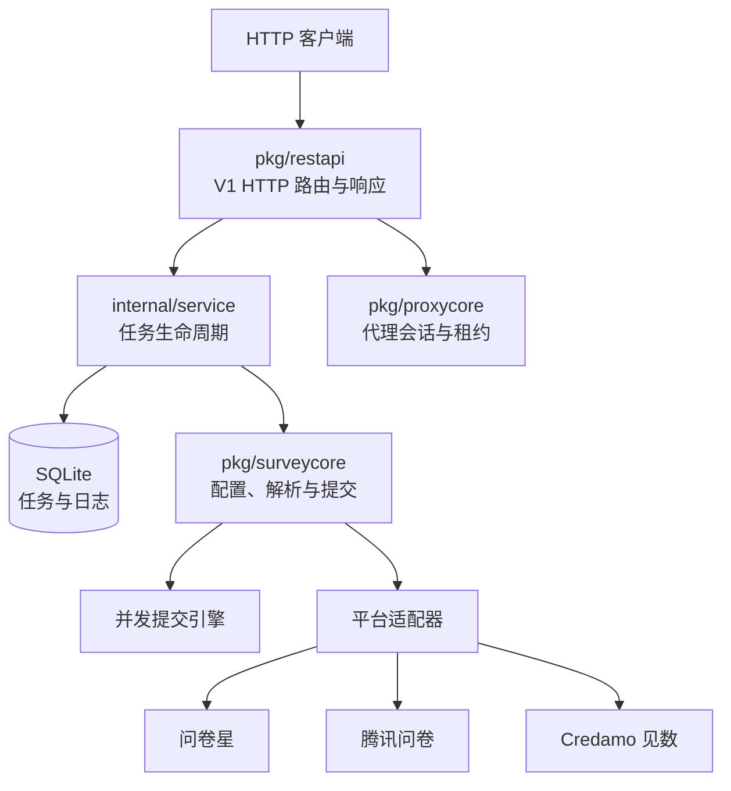

# SurveyCore

SurveyCore 是 SurveyController 使用的问卷解析、配置、提交、代理和任务 REST 核心。


[SurveyController](https://github.com/SurveyController/SurveyController) 的核心 HTTP 提交 API 服务。

负责解析问卷、创建提交任务、查询任务、停止任务、读取任务日志和解析二维码。

> [!CAUTION]
>
> 本项目仅可用于已授权问卷的学习与测试。严禁用于污染第三方问卷数据！

## 支持平台

- [x] 问卷星
- [x] 腾讯问卷
- [x] Credamo 见数
- [ ] ...（欢迎贡献！）

## 使用方法

### 环境要求

- Go 1.26.7（最低支持 Go 1.26.5）

如果还没有安装 Go，可以从 [Go 官方网站](https://go.dev/dl/) 下载并安装适合您操作系统的版本。

### 部署与运行

```bash
git clone https://github.com/SurveyController/SurveyCore.git
cd SurveyCore
go mod download
go build -o surveycore ./cmd/surveycore
./surveycore
```

### API 文档

见 https://surveydoc.hungrym0.com/sdk

## 架构概览



## 服务地址

默认监听：

```text
127.0.0.1:19178
```

服务启动配置默认读取：

```text
configs/surveycore.toml
```

示例：

```toml
[server]
port = 19178

[storage]
db_path = "data/surveycore-v1.db"

[ai]
base_url = "https://api.deepseek.com/v1"
model = "deepseek-chat"
api_key = ""
```

服务固定监听 `127.0.0.1`，配置文件只改端口。

## 接口列表

| 方法 | 路由 | 作用 |
|---|---|---|
| `GET` | `/api/v1/health` | 健康检查。服务可用时返回正常状态。 |
| `GET` | `/api/v1/version` | 读取 V1 服务版本号。 |
| `GET` | `/api/v1/tasks` | 查询任务列表。按创建时间倒序返回。 |
| `GET` | `/api/v1/tasks/{id}` | 查询单个任务详情。 |
| `GET` | `/api/v1/tasks/{id}/logs` | 分页读取任务日志。 |
| `POST` | `/api/v1/surveys/parse` | 解析问卷，不提交答案。 |
| `POST` | `/api/v1/configs` | 生成 V1 默认运行配置。 |
| `POST` | `/api/v1/tasks` | 创建异步提交任务。 |
| `POST` | `/api/v1/tasks/{id}/stop` | 停止任务。 |
| `POST` | `/api/v1/qrcode/decode` | 从二维码图片中解析问卷链接。 |
| `POST` | `/api/v1/proxy/session` | 激活官方代理会话。 |
| `GET` | `/api/v1/proxy/usage` | 查询官方代理余量。 |
| `POST` | `/api/v1/proxy/extract` | 提取官方代理。 |
| `POST` | `/api/v1/proxy/bonus` | 领取代理额度。 |
| `POST` | `/api/v1/proxy/redeem` | 兑换代理卡。 |

## 错误响应

API 错误统一返回稳定错误码、用户消息和调试详情：

```json
{
  "code": "validation_error",
  "message": "invalid config: 必须提供问卷链接",
  "detail": "invalid config: 必须提供问卷链接"
}
```

常见错误码：

| 错误码 | 含义 |
|---|---|
| `invalid_json` | JSON 请求体格式错误，或包含不被该接口接受的字段。 |
| `invalid_request` | 请求格式不符合接口要求，例如 multipart 表单无效。 |
| `invalid_query` | 查询参数无效，例如日志游标或条数非法。 |
| `validation_error` | 业务参数未通过校验。 |
| `not_found` | 任务或资源不存在。 |
| `upstream_error` | 问卷平台解析、配置生成等上游调用失败。 |
| `internal_error` | 服务内部错误。 |

## 任务状态

| 状态 | 含义 |
|---|---|
| `pending` | 已创建，等待运行。 |
| `running` | 正在运行。 |
| `succeeded` | 已完成。 |
| `failed` | 执行失败。 |
| `stopped` | 已停止。 |
| `interrupted` | 服务重启导致中断。 |

## 许可证

Mozilla Public License Version 2.0

本项目依据 `Mozilla Public License Version 2.0`（MPL-2.0）发布。使用、复制、修改或分发本项目时，应遵守 MPL-2.0 条款。

若分发包含本项目源码文件修改内容的版本，需要保留版权和许可证声明，说明必要的变更，并按 MPL-2.0 开源这些修改过的源文件。

与本项目以独立文件组合形成的更大作品，可按自身选择的许可证分发，但不得限制接收者依据 MPL-2.0 取得和使用本项目相关源代码的权利。
